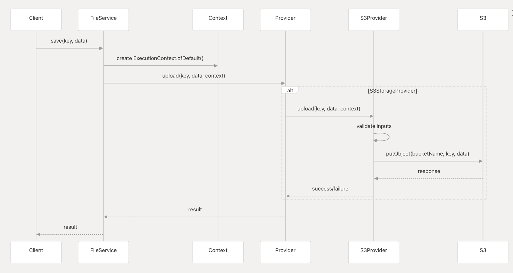
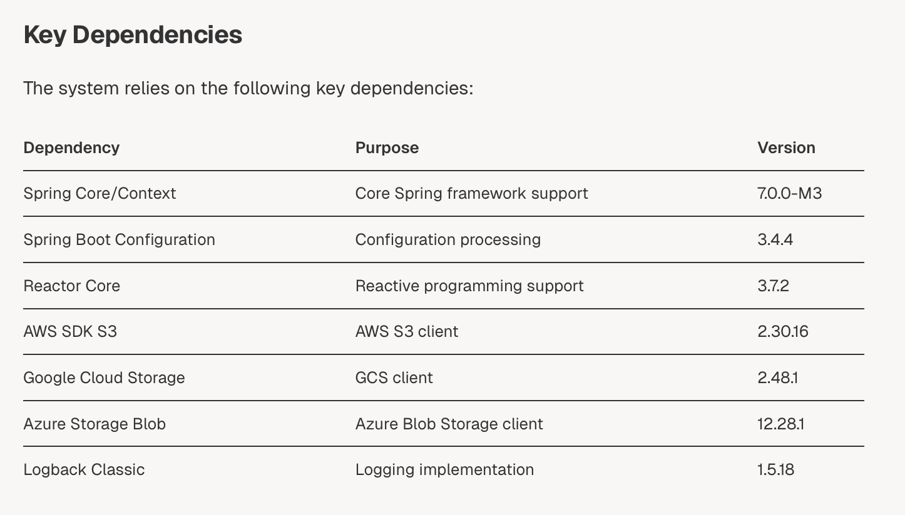

# Spring Multi-Cloud Storage Engine

The **Spring Multi-Cloud Storage Engine** is a robust, scalable Java-based application built with Spring Boot that
provides a unified interface for interacting with multiple cloud storage providers, such as AWS S3, Google Cloud
Storage, and Azure Blob Storage. This project abstracts the complexities of vendor-specific APIs, enabling developers to
manage files across different cloud platforms seamlessly. It is designed for enterprise-grade applications requiring
flexible, provider-agnostic storage solutions.

## Features

- **Unified API**: Perform file operations (upload, download, delete) across multiple cloud providers using a
  single interface.
- **Provider Support**: Integrates with AWS S3, Google Cloud Storage, and Azure Blob Storage (extensible for other
  providers).
- **Dynamic Configuration**: Switch between cloud providers at runtime via configuration.
- **Fault Tolerance**: Handles provider-specific errors and implements retry mechanisms for reliability.
- **Scalability**: Built with Spring Boot for high performance and scalability in distributed systems.
- **Extensible Design**: Easily add support for new cloud storage providers through modular adapters.





## Setup Instructions

### 1. Clone the Repository

````bash
   git clone https://github.com/Aliabbos-Ashurov/spring-multi-cloud-storage-engine.git
   cd spring-multi-cloud-storage-engine
````

### 2. Configure Cloud Providers

````YAML
multi-cloud:
  storage:
    aws:
      enabled: true
      access-key: ${AWS_ACCESS_KEY}
      secret-key: ${AWS_SECRET_KEY}
      bucket-name: ${AWS_BUCKET_NAME}
      region: ${AWS_REGION}
    gcs:
      ...
    azure-blob:
      ...
````

### 3. Implement FileService
````Java
@Service
public class FileService {
    public StorageProvider provider;

    public FileService(@Qualifier("s3StorageProvider") StorageProvider provider) {
        this.provider = provider;
    }

    public void save(String key, byte[] bytes) {
        provider.upload(key, bytes, ExecutionContext.ofDefault());
    }
}
````
